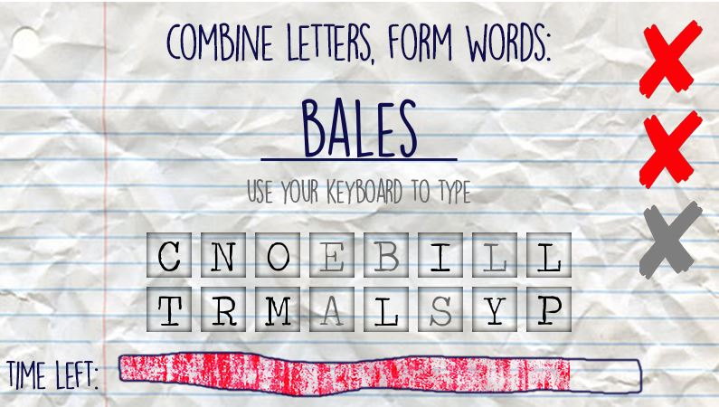

How to Play
===========

Upon starting the game, you will be greeted by the
main menu screen. Here, you can choose from the two
game modes, **Anagram Mode** and **Combine Mode**. You can
also choose to **quit the application**; and you can quit the
application any time in the game by clicking on the default
close button of the program window.

Anagram Mode
------------

In Anagram Mode, you are tasked to find anagrams of the word
shown on the screen. The word and its anagrams are based off
the dictionary file you used. To play, simply use your keyboard
to type, and pressing `Enter` will confirm your answer.

.. image:: 2.jpg
   :align: center

Combine Mode
------------

In Combine Mode, you are to find words that use letters from
the letter pool below the answer line. You may only use a letter
once in an answer, and you can't repeat previously correct answers.

Ending the Game
---------------

Both game modes will end when the **timer bar on the bottom is emptied**
(in 100 seconds) or when you **hit three mistakes**. Other than that,
it is possible to end the game prematurely when you have **found all possible anagrams of a word** (Anagram Mode)
or when you have **reached the absolute maximum number of points achievable** (Combine Mode).

In the score screen after the game ends, either your equivalent scrabble points or your number
of words solved shows up, in Combine Mode and Anagram Mode, respectively.

.. image:: 4.jpg
   :align: center

